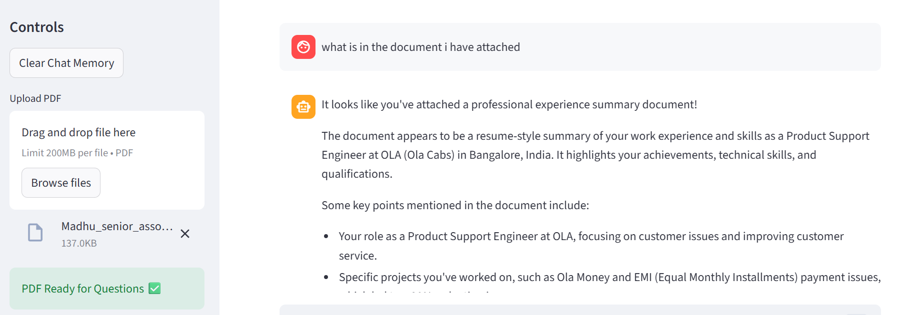

Perfect 👍 — now that your project is **complete + live**, your `README.md` should look **professional, recruiter-friendly, and GitHub-standard**.

Below are **ready-to-copy data points** you can directly paste into your README.

---

# ✅ Complete `README.md` Content (Copy & Paste)

You can create/edit:

```
README.md
```

in your GitHub repo and paste this.

---

# 🤖 AI Assistant Platform

A full-stack **AI Assistant Platform** built using **Streamlit, Local LLMs, RAG architecture, and Voice Interaction**, capable of conversational AI, document question answering, persistent memory, and speech-based interaction.

---

## 🚀 Live Demo

🌐 **Live App:**
`https://your-cloudflare-link.trycloudflare.com`

💻 **GitHub Repository:**
[https://github.com/MadhuH59/AI_Chatbot-local](https://github.com/MadhuH59/AI_Chatbot-local)

---

## 📌 Project Overview

This project implements a **ChatGPT-like AI assistant** running locally using Ollama LLMs and enhanced with Retrieval-Augmented Generation (RAG) for document understanding.

The assistant supports:

* Natural conversation
* PDF-based question answering
* Persistent chat memory
* Voice interaction
* Multi-modal AI workflow

---

## ✨ Features

✅ ChatGPT-style conversational interface
✅ Local LLM integration (Ollama – Llama3)
✅ Retrieval-Augmented Generation (RAG)
✅ PDF Question Answering system
✅ Vector database semantic search (FAISS)
✅ Persistent memory storage
✅ Voice input (Speech-to-Text)
✅ AI voice responses (Text-to-Speech)
✅ Streamlit web interface
✅ Live public deployment

---

## 🧠 Architecture

```
User Input (Text / Voice)
        ↓
Streamlit UI
        ↓
Memory System
        ↓
RAG Pipeline (LangChain)
        ↓
FAISS Vector Database
        ↓
Local LLM (Ollama)
        ↓
AI Response + Voice Output
```

---

## 🛠️ Tech Stack

| Category           | Technology                        |
| ------------------ | --------------------------------- |
| Language           | Python                            |
| UI Framework       | Streamlit                         |
| LLM Runtime        | Ollama                            |
| Model              | Llama3                            |
| RAG Framework      | LangChain                         |
| Vector Database    | FAISS                             |
| Embeddings         | HuggingFace Sentence Transformers |
| Speech Recognition | SpeechRecognition                 |
| Text-to-Speech     | pyttsx3                           |
| Deployment         | Cloudflare Tunnel                 |

---

## 📂 Project Structure

```
AI_Chatbot-local/
│
├── app.py
├── utils/
│   ├── memory.py
│   ├── pdf_qa.py
│   ├── voice.py
│   └── __init__.py
│
├── data/
│   ├── uploads/
│   └── vector_db/
│
├── memory/
│   └── chat_memory.json
│
└── README.md
```

---

## ⚙️ Installation & Setup

### 1️⃣ Clone Repository

https://img.shields.io/badge/Python-3.12-blue

```bash
git clone https://github.com/MadhuH59/AI_Chatbot-local.git
cd AI_Chatbot-local
```

---

### 2️⃣ Create Virtual Environment

```bash
python -m venv venv
venv\Scripts\activate
```

---

### 3️⃣ Install Dependencies

```bash
pip install -r requirements.txt
```

---

### 4️⃣ Run Ollama Model
https://img.shields.io/badge/LLM-Ollama-green

```bash
ollama run llama3
```

---

### 5️⃣ Start Application

https://img.shields.io/badge/Streamlit-App-red

```bash
streamlit run app.py
```

Open:

```
http://localhost:8501
```

## ✅ Small Summary of **Streamlit**

**Streamlit** is a Python framework used to build **interactive web applications** directly from Python code.
It allows developers to create dashboards, AI apps, and chat interfaces **without using HTML, CSS, or JavaScript**.

👉 You write Python → Streamlit automatically creates a website and runs it in your browser.

**Key idea:**

> Streamlit converts Python scripts into web apps quickly and easily.


### 🧠 One-Line Understanding

**Streamlit = fastest way to turn Python programs into web apps.**

---

## 📄 How RAG Works

1. Upload PDF document
2. Text is split into chunks
3. Embeddings generated using HuggingFace models
4. Stored in FAISS vector database
5. User query performs semantic similarity search
6. Retrieved context injected into LLM prompt
7. AI generates context-aware response

---

## 🎙️ Voice Assistant Workflow

```
Speech → Text → AI Processing → Response → Speech Output
```

---

## 📸 Screenshots()

* Chat Interface: 

* PDF QA

* Voice Interaction

---

## 🔮 Future Improvements

* Multi-model selection
* Wake-word detection ("Hey Jarvis")
* User authentication
* Cloud deployment (AWS/GCP)
* Database-backed memory
* Agent-based automation

---

## 👨‍💻 Author

**Madhu H**

📧 [madhuh0059@gmail.com](mailto:madhuh0059@gmail.com)
🔗 GitHub: [https://github.com/MadhuH59](https://github.com/MadhuH59)

---

## ⭐ Resume Description

Built a full-stack AI Assistant Platform featuring conversational AI, Retrieval-Augmented Generation (RAG), PDF question answering, persistent memory, and voice interaction using Streamlit, LangChain, FAISS, and local LLMs.

---


